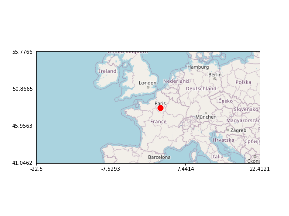

Smopy
=====

**New: you may be interested in [Folium](https://github.com/wrobstory/folium) for interactive maps with Leaflet.js**

Give a box in geographical coordinates (latitude/longitude) and a zoom level, Smopy returns an OpenStreetMap tile image!

```python
import smopy

BBox =(42., -1., 55., 3.)

map = smopy.Map((BBox[0], BBox[1], BBox[2], BBox[3]), z=4)
map.show_ipython()
```


You can also import the map in matplotlib and convert from geographical coordinates to pixels easily.

```python
x, y = map.to_pixels(48.86151, 2.33474)
ax = map.show_mpl(figsize=(8, 6))
ax.plot(x, y, 'or', ms=10, mew=2);
```


Alternative OSM tile servers can be used as well. An example is in the example notebook.

[See the example notebook](http://nbviewer.ipython.org/github/rossant/smopy/blob/master/examples/example1.ipynb)

You can get Lat, Long axis.
```python
import matplotlib.pyplot as plt
import numpy as np

xsteps=4
ysteps=4
x, y = map.to_pixels(48.86151, 2.33474)

fig, ax= plt.subplots(figsize=(8,6))
map.show_mpl(ax =ax,)
ax.plot(x, y, 'or', ms=10, mew=2);

#get coordinates to img coorners
BBox=list(map.to_coords(0,0)+map.to_coords(map.w-1,map.h-1))

plt.yticks(np.linspace(0,map.h-1,ysteps,endpoint=True),np.around(np.linspace(BBox[0],BBox[2],ysteps,endpoint=True),decimals=4));
plt.xticks(np.linspace(0,map.w-1,xsteps,endpoint=True),np.around(np.linspace(BBox[1],BBox[3],xsteps,endpoint=True),decimals=4));
```

## Installation

Smopy currently requires:

* Pillow
* NumPy
* matplotlib
* IPython

To install, `pip install smopy` or:

```python
git clone git@github.com:rossant/smopy.git
cd smopy
python setup.py develop
```


## Terms of use

This module fetches image maps from [OpenStreetMap](http://www.openstreetmap.org/)'s servers. See the [usage policy](http://wiki.openstreetmap.org/wiki/Tile_usage_policy). In particular, **be careful not to retrieve large maps** as this can overload the servers.


